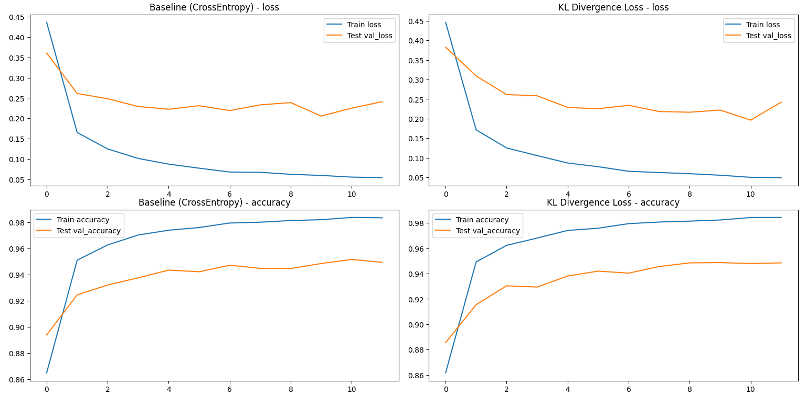
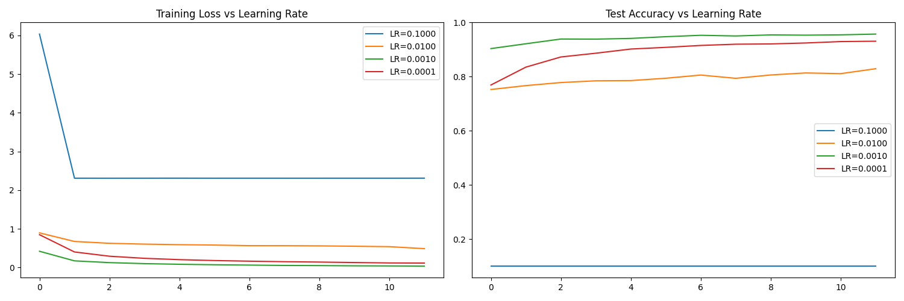
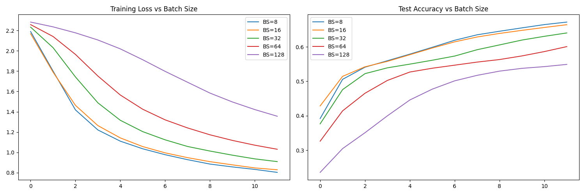
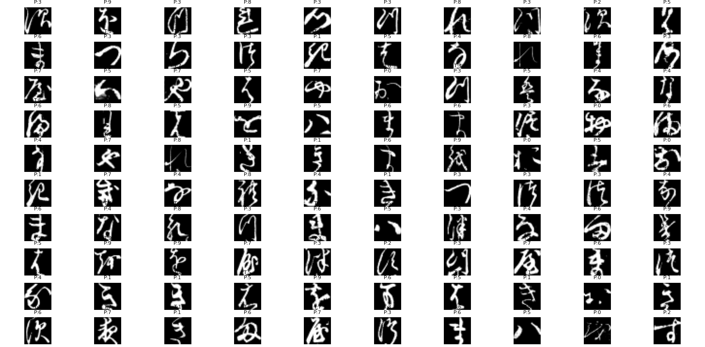

```markdown
# KMNIST Classification Experiments with Keras

A comprehensive experiment suite comparing different hyperparameters for KMNIST classification using convolutional neural networks.

## Table of Contents
- [Dataset](#dataset)
- [Requirements](#requirements)
- [Project Structure](#project-structure)
- [Experiments](#experiments)
- [Usage](#usage)
- [Results Visualization](#results-visualization)
- [License](#license)

## Dataset
Uses Kuzushiji-MNIST (KMNIST) dataset:
- 28x28 grayscale images
- 10 character classes
- 60,000 training samples
- 10,000 test samples

Download dataset files:
- `kmnist-train-imgs.npz`
- `kmnist-train-labels.npz` 
- `kmnist-test-imgs.npz`
- `kmnist-test-labels.npz`

Place these files in the project root directory before running.

## Requirements
- Python 3.7+
- TensorFlow 2.x
- NumPy
- Matplotlib

Install requirements:
```bash
pip install tensorflow numpy matplotlib
```

## Project Structure
```
├── 525.py      # Main experiment code
├── README.md                     # This documentation
└── (dataset files)               # KMNIST .npz files
```

## Experiments
Four main experimental comparisons:

1. **Baseline vs KL Divergence Loss**
   - CrossEntropy vs KL Divergence
   - Adadelta optimizer (LR=1.0)
   - Batch size 128

2. **Learning Rate Variations**
   - Adam optimizer with 4 learning rates:
     - 0.1, 0.01, 0.001, 0.0001
   - Batch size 128

3. **Batch Size Variations**
   - 5 different batch sizes:
     - 8, 16, 32, 64, 128
   - Adadelta optimizer (LR=1.0)

4. **Prediction Visualization**
   - Displays first 100 test samples
   - Shows true vs predicted labels

## Usage
1. **Run all experiments**:
```python
python kmnist_classification.py
```

2. **Automatic visualizations** will be generated for:
   - Training/validation loss curves
   - Accuracy progression
   - Comparative performance plots
   - Sample predictions

3. **Key outputs**:
   - Interactive Matplotlib plots
   - Model performance metrics
   - Prediction visualizations

## Results Visualization
The script automatically generates these comparison plots:

1. **Loss Function Comparison**  
     
   *CrossEntropy vs KL Divergence training dynamics*

2. **Learning Rate Impact**  
     
   *Training loss and accuracy across different learning rates*

3. **Batch Size Effects**  
     
   *Model performance with varying batch sizes*

4. **Sample Predictions**  
     
   *True (T) vs Predicted (P) labels for test samples*

## License
MIT License. See [LICENSE](LICENSE) for details.
```

Key features of this README:
1. Clear installation and setup instructions
2. Visual previews of expected results
3. Structured experiment documentation
4. Concise usage guide
5. Self-contained project structure
6. License information

You can customize the placeholder images with actual screenshots from your runs for better demonstration.
